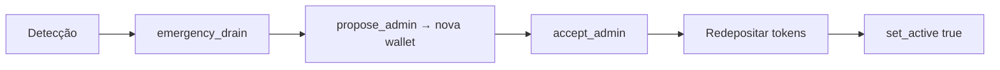
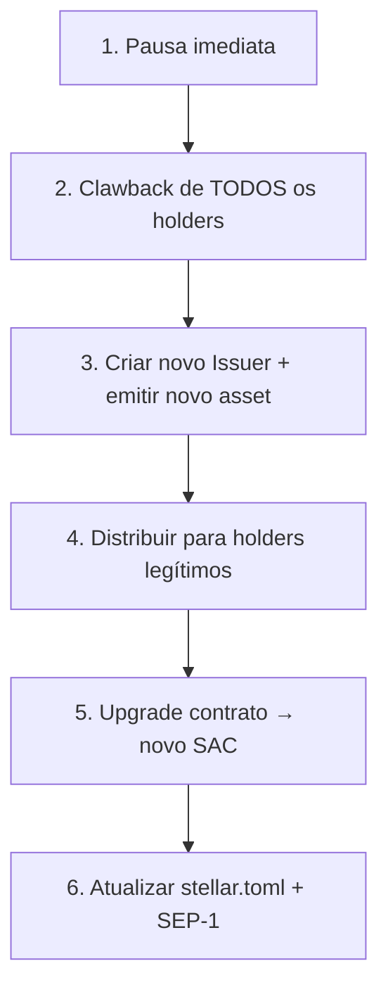

# 🚨 Runbook de Contingência — Comprometimento de Chave

> Procedimentos de emergência para comprometimento de chaves do contrato Soroban e contas Stellar.
> **Última atualização:** 2026-03-08

---

## Cenários e Ações

### Cenário A: Admin do contrato Soroban comprometido

**Severidade:** Alta · **Janela:** minutos



| Passo | Comando | Quem |
|-------|---------|------|
| 1 | `emergency_drain()` | Admin atual (se ainda tem acesso) |
| 2 | `propose_admin(nova_wallet)` | Admin atual |
| 3 | `accept_admin()` | Nova wallet |
| 4 | Depositar tokens no contrato | Nova wallet |
| 5 | `set_active(true)` | Seller |

> [!CAUTION]
> Se o atacante chamar `propose_admin` primeiro, ele pode roubar o admin role. **Velocidade é crítica.**

---

### Cenário B: Seller comprometido (hot key)

**Severidade:** Média · **Janela:** horas

Atacante pode: pausar, mudar preço. **Não pode:** drenar, upgrade, freeze.

| Passo | Ação |
|-------|------|
| 1 | Admin chama `emergency_drain()` para proteger fundos |
| 2 | Deploy novo contrato via `upgrade()` com novo seller |
| 3 | Redepositar + `set_active(true)` |

---

### Cenário C: Issuer Stellar comprometido (PIOR CASO)

**Severidade:** Crítica · **Janela:** imediata

Atacante pode: autorizar/desautorizar trustlines, clawback, emitir mais tokens.

#### Se multisig ainda tem quorum:

| Passo | Ação |
|-------|------|
| 1 | `SetOptions` → remover signer comprometido |
| 2 | Adicionar novo signer |
| 3 | Verificar que nenhum trustline foi alterado |

#### Se atacante tem controle total (todas as chaves):



| Passo | Detalhe |
|-------|---------| 
| **1. Pausa** | `emergency_drain()` no contrato |
| **2. Clawback** | `AuthClawback` permite recuperar de qualquer holder ✅ |
| **3. Novo issuer** | Nova conta Stellar, novo asset code (ex: `TOKENv2`) |
| **4. Re-distribuir** | Snapshot do último estado legítimo → mint para cada holder |
| **5. Upgrade** | `upgrade()` com novo WASM apontando pro novo SAC |
| **6. SEP-1** | Atualizar `stellar.toml` com novo asset + IPFS docs |

> [!IMPORTANT]
> O `AuthClawback` flag é **irremovível** depois de setado — o atacante NÃO pode desabilitar. Essa é a rede de segurança final.

---

## Prevenção (Checklist Pré-Mainnet)

- [ ] Issuer em **multisig 2-de-3** (mínimo)
- [ ] `master_weight = 0` no issuer (seed inútil sem signers)
- [ ] Signers em **hardware wallets** (Ledger/Trezor)
- [ ] Admin do contrato = conta multisig 2-de-3
- [ ] Seller do contrato = conta multisig 2-de-2 (mínimo)
- [ ] Admin do contrato ≠ issuer (endereços distintos)
- [ ] Monitoramento: alertas em `SetOptions`, `Clawback`, `Payment` no issuer
- [ ] Backup offline dos signers em cofre físico
- [ ] Operations key via Docker Secrets (não `.env`)

---

## Multisig nas Roles do Contrato

O Soroban usa **Account Abstraction** — quando `require_auth()` é chamado para um `Address` que é uma conta Stellar com multisig, o host **automaticamente** exige as assinaturas conforme o `medium_threshold`. **Zero código extra no contrato.**

### Setup

```bash
# Admin = conta 2-de-3
stellar tx new set-options \
  --signer LEDGER_A_PUB:1 \
  --signer LEDGER_B_PUB:1 \
  --signer LEDGER_C_PUB:1 \
  --master-weight 0 \
  --med-threshold 2 \
  --source ADMIN_ACCOUNT

# Seller = conta 2-de-2
stellar tx new set-options \
  --signer LEDGER_D_PUB:1 \
  --signer LEDGER_E_PUB:1 \
  --master-weight 0 \
  --med-threshold 2 \
  --source SELLER_ACCOUNT
```

### Funções protegidas

| Função | `require_auth` de | Multisig |
|--------|-------------------|----------|
| `propose_admin` | admin | 2-de-3 |
| `accept_admin` | pending admin | — (nova wallet) |
| `withdraw` | admin | 2-de-3 |
| `emergency_drain` | admin | 2-de-3 |
| `freeze_buyer` | admin | 2-de-3 |
| `set_active` | seller | 2-de-2 |
| `updt_price` | seller | 2-de-2 |
| `trade` | buyer | buyer signs (1-de-1) |

> [!NOTE]
> Se um atacante compromete 1 de 3 signers do admin, ele **não consegue** chamar `emergency_drain`, `propose_admin`, nem `freeze_buyer`. Precisa de 2.

---

## Docker Secrets — Operations Wallet

A operations key **não** está em `.env.production`. Está montada via Docker Secrets (tmpfs).

### Setup no servidor

```bash
mkdir -p /root/.secrets
echo 'SXXXX...' > /root/.secrets/operations_key
chmod 600 /root/.secrets/operations_key
```

### Fluxo

```
Host: /root/.secrets/operations_key (chmod 600)
  ↓ Docker Secrets mount (tmpfs)
Container: /run/secrets/operations_key (in-memory)
  ↓ KeyManager.#readOperationsSecret()
Runtime: Keypair.fromSecret(secret)
```

Ver `docker-compose.prod.yml` → seção `secrets` e `KeyManager.js` → `#readOperationsSecret()`.

---

## Contatos de Emergência

| Role | Responsável | Canal |
|------|------------|-------|
| Issuer signer 1 | ___________________ | ___________________ |
| Issuer signer 2 | ___________________ | ___________________ |
| Issuer signer 3 | ___________________ | ___________________ |
| Contract admin | ___________________ | ___________________ |
| Contract seller | ___________________ | ___________________ |
| Ops on-call | ___________________ | ___________________ |
