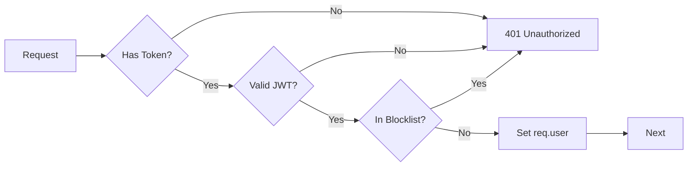

# Backend Middleware

> **Path**: `backend/src/middleware/` | **Count**: 6 files

Middleware functions that process requests before they reach controllers.

---

## Middleware Overview

| File | Size | Purpose |
|------|------|---------|
| [[auth.js]] | 5.6KB | JWT verification + Redis blocklist |
| [[authorize.js]] | 7.7KB | Role-based authorization |
| [[rateLimit.js]] | 5.6KB | Multi-tier rate limiting |
| [[requireVerification.js]] | 2.1KB | Email verification check |
| [[errorHandler.js]] | 1.6KB | Global error handling |
| [[validator.js]] | 0.7KB | Request validation wrapper |

---

## Detailed Descriptions

### [[auth.js]] ⭐
> **JWT Authentication + Token Blocklist**

**Exports:**
- `authenticateToken` — Verify JWT, check blocklist
- `optionalAuth` — Auth without failing if missing

**Flow:**


**Blocklist Check:**
```javascript
// Uses Redis SET for O(1) lookup
const isBlocked = await redisClient.sismember('token_blocklist', token);
```

---

### [[authorize.js]]
> **Role-Based Authorization**

**Exports:**
- `requireInvestor` — Must be investor
- `requireCompanyUser` — Must be company user
- `requirePlatformAdmin` — Must be admin
- `requireRole(...roles)` — Generic role check

**Usage:**
```javascript
router.get('/dashboard', 
  authenticateToken, 
  requirePlatformAdmin, 
  DashboardController.get
);
```

---

### [[rateLimit.js]] ⭐
> **Multi-Tier Rate Limiting**

**Limiters:**
| Name | Window | Max | Purpose |
|------|--------|-----|---------|
| `strictLimiter` | 1h | 5 | Investor registration |
| `authLimiter` | 15min | 10 | Login attempts |
| `apiLimiter` | 15min | 100 | General API |
| `uploadLimiter` | 1h | 10 | File uploads |

**Store:**
- Redis store (production)
- Memory store (fallback)

---

### [[requireVerification.js]]
> **Email Verification Enforcement**

Checks `emailVerified` field before allowing access to protected routes.

**Usage:**
```javascript
router.post('/invest',
  authenticateToken,
  requireInvestor,
  requireVerification,  // Must have verified email
  InvestmentController.create
);
```

---

### [[errorHandler.js]]
> **Global Error Handler**

Catches all unhandled errors and formats consistent responses:

```javascript
{
  success: false,
  error: "Error message",
  code: "ERROR_CODE",  // if available
  stack: "..."  // only in development
}
```

---

### [[validator.js]]
> **Validation Wrapper**

Wraps `express-validator` to standardize validation error responses.

---

## Middleware Stack Order

Applied in `app.js`:

```javascript
app.use(helmet());          // Security headers
app.use(cors());            // CORS
app.use(express.json());    // Body parsing
app.use(morgan('dev'));     // Request logging
// Routes with middleware...
app.use(errorHandler);      // Error handling (last)
```

---

## Related

- [[backend/routes/_INDEX]] — Route definitions
- [[backend/config/redis]] — Redis client
- [[backend/_INDEX]] — Backend overview
