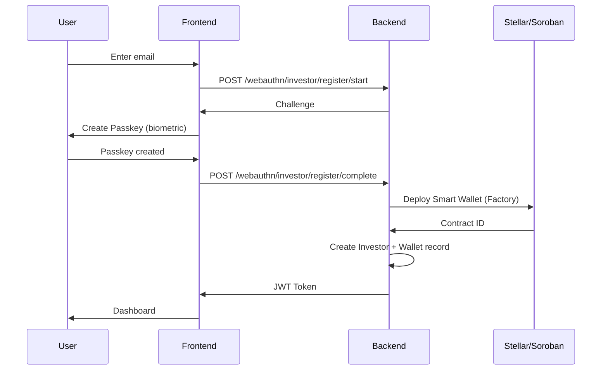
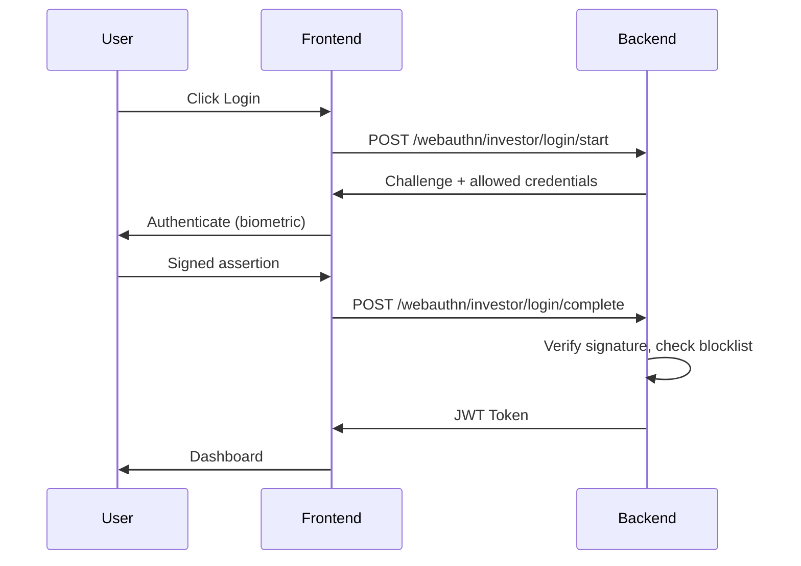
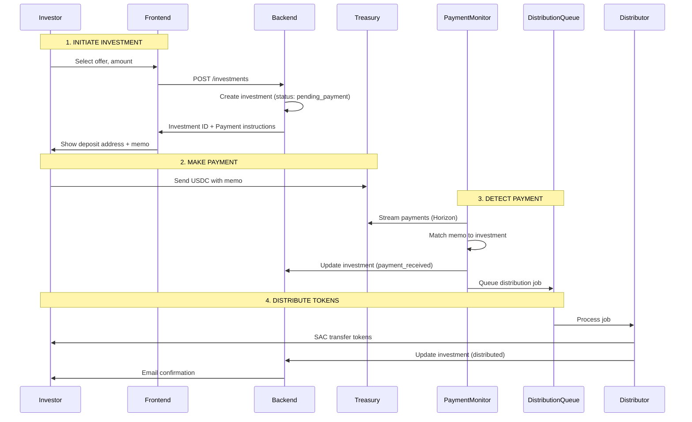
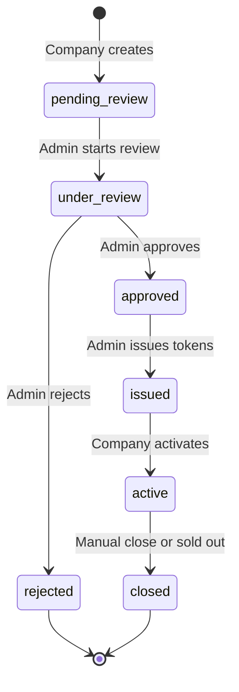
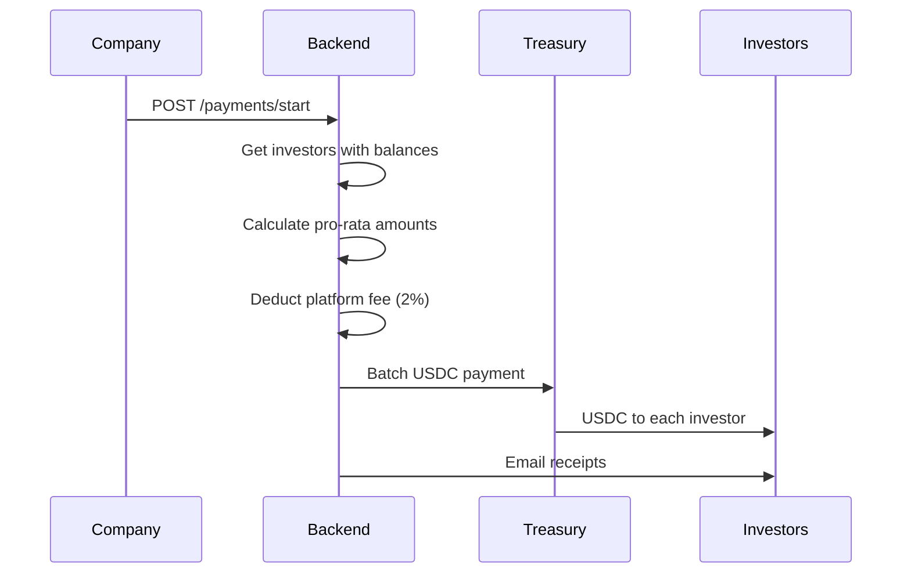
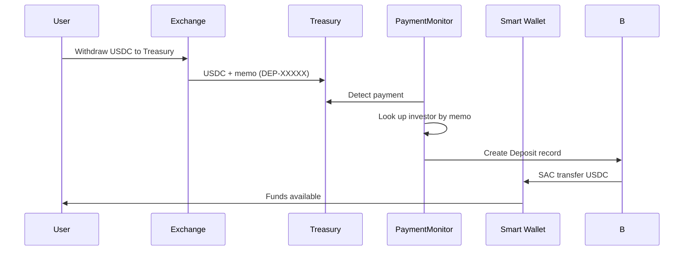
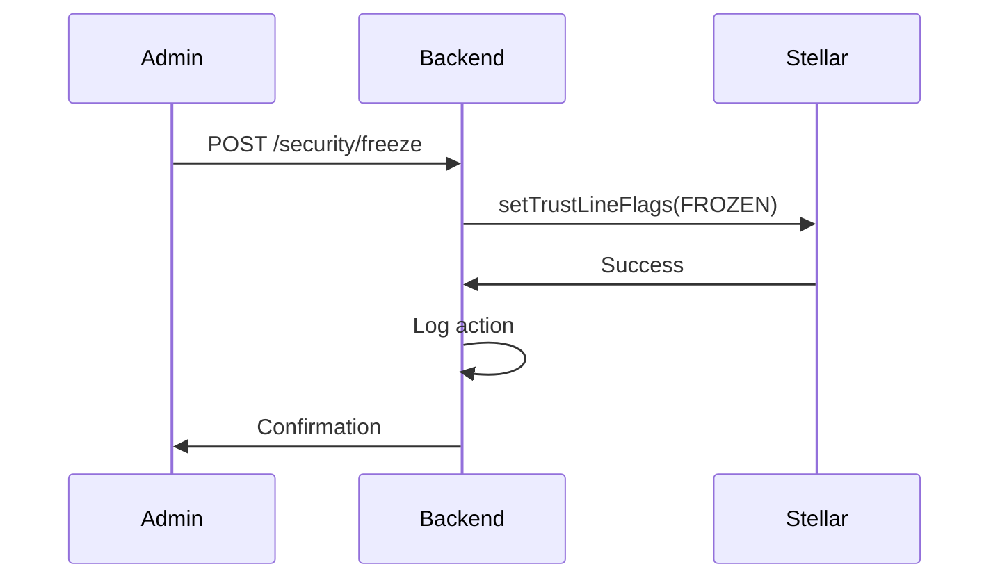
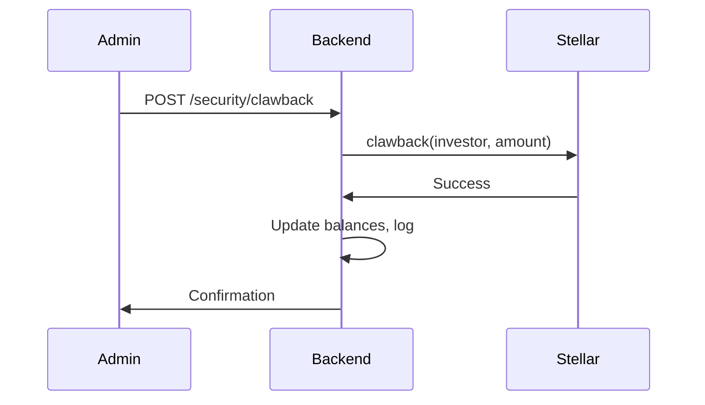

# System Flow Documentation

> End-to-end flows through the platform

---

## Flow Overview

| Flow | Description |
|------|-------------|
| [[flows/authentication]] | Passkey registration & login |
| [[flows/investment]] | Investor → USDC → Tokens |
| [[flows/offer_lifecycle]] | Draft → Review → Issue → Active |
| [[flows/dividend_payment]] | Company → USDC → Investors |
| [[flows/deposit_relay]] | Treasury → Smart Wallet |
| [[flows/kyc_approval]] | KYC submission → Approval |
| [[flows/token_compliance]] | Freeze, Unfreeze, Clawback |

---

## [[flows/authentication|Authentication Flow]] ⭐

### Investor Registration



### Login Flow



---

## [[flows/investment|Investment Flow]] ⭐



---

## [[flows/offer_lifecycle|Offer Lifecycle]]



### Status Descriptions

| Status | Description |
|--------|-------------|
| `pending_review` | Awaiting admin review |
| `under_review` | Admin reviewing |
| `approved` | Ready for token issuance |
| `issued` | Tokens minted, pending launch |
| `active` | Live, accepting investments |
| `closed` | No longer accepting |
| `rejected` | Rejected by admin |

---

## [[flows/dividend_payment|Dividend Payment]]



### Calculation

```
monthly_interest = (annual_rate / 12) * token_balance
net_payment = monthly_interest - platform_fee
```

---

## [[flows/deposit_relay|Deposit Relay]]

> For users depositing via Classic Stellar (exchanges)



---

## [[flows/token_compliance|Compliance Actions]]

### Freeze Account



### Clawback



---

## Related

- [[overview/architecture]] — System architecture
- [[backend/services/_INDEX]] — Service logic
- [[docs/SYSTEM_FLOW]] — Original flow doc
