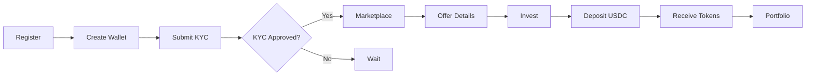

# Investor Dashboard Pages

> **Path**: `frontend/src/pages/investor/` | **Count**: 7 pages

Dashboard for investors. Access via Passkey authentication after registration.

---

## Page Overview

| Page | Size | Purpose |
|------|------|---------|
| [[Wallet.tsx]] | 36KB | Smart wallet (main page) |
| [[Portfolio.tsx]] | 17KB | Token holdings |
| [[Settings.tsx]] | 15KB | Profile & KYC |
| [[Dashboard.tsx]] | 9KB | Investor overview |
| [[OfferDetails.tsx]] | 8KB | Investment page |
| [[Transactions.tsx]] | 7KB | Transaction history |
| [[Marketplace.tsx]] | 3KB | Active offers |

---

## Detailed Descriptions

### [[Wallet.tsx]] ⭐ (36KB)
> **Primary investor interface**

Features:
- View USDC balance
- View XLM balance
- Deposit USDC (QR code + memo)
- Withdraw USDC
- View token balances
- Transaction history

Key Components:
- Deposit address with QR code
- Unique memo for payment matching
- Balance cards
- Withdrawal form

### [[Portfolio.tsx]]
> **Token holdings view**

Displays:
- All token holdings
- Per-token balances
- Investment amounts
- Upcoming dividends
- Payment history

### [[Settings.tsx]]
> **Profile & KYC management**

Sections:
- Profile info (read-only after KYC)
- KYC status indicator
- Passkey management
- Recovery signers

### [[OfferDetails.tsx]]
> **Investment page**

Functions:
- View offer details
- View financial terms
- See legal documents (IPFS)
- Initiate investment
- Payment instructions

### [[Marketplace.tsx]]
> **Active offers**

Simple listing of:
- All active offers
- Basic info (yield, maturity)
- Links to offer details

---

## User Journey

---

## Related

- [[frontend/_INDEX]] — Frontend overview
- [[backend/routes/investorRoutes]] — Investor API
- [[flows/investment]] — Investment flow
