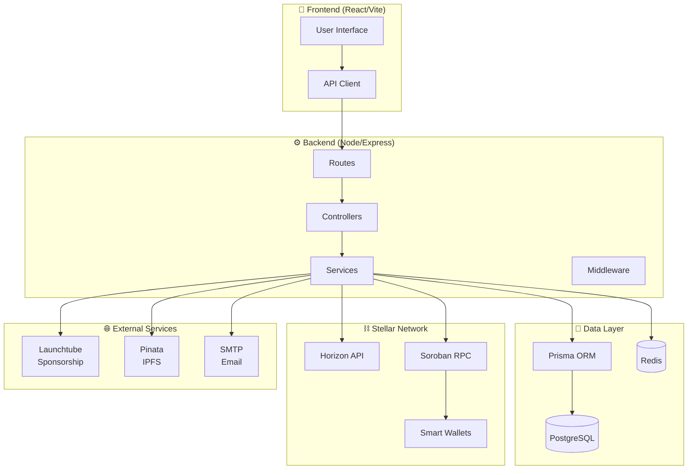
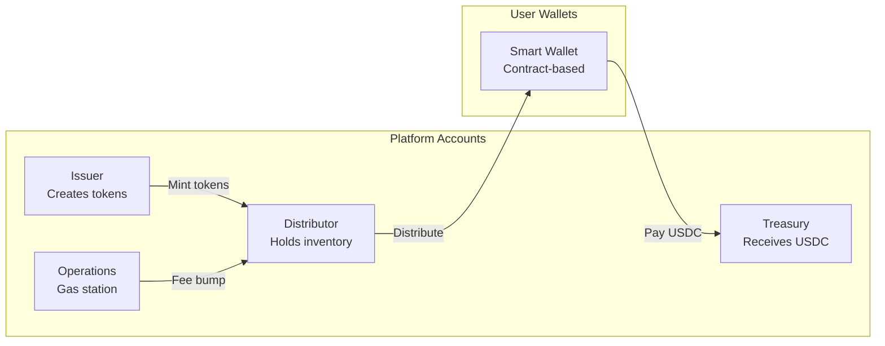
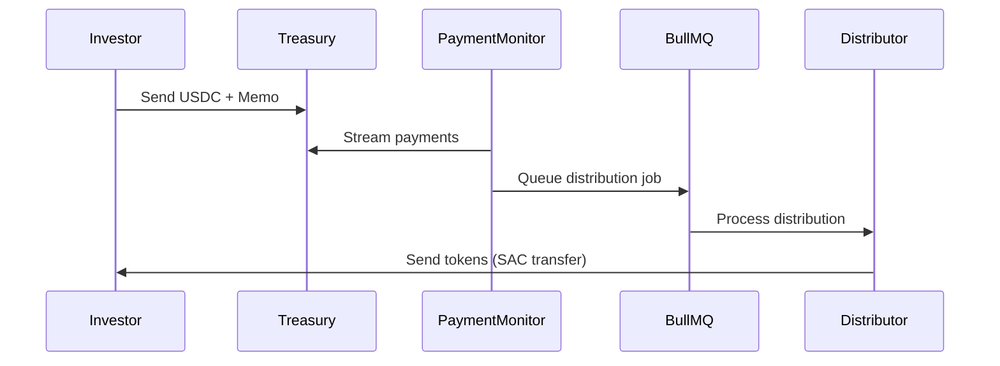

# System Architecture

> **Platform**: Stellar Security Tokens — A blockchain-based RWA tokenization platform

---

## High-Level Architecture

---

## Core Components

### User Roles

| Role | Description | Auth Method |
|------|-------------|-------------|
| **Investor** | Individual buying tokens | Passkey (Smart Wallet) |
| **Company** | Token issuers | Passkey (Smart Wallet) |
| **Platform Admin** | System operators | Email OTP + Passkey |

### Account Architecture (Stellar)

---

## Data Flow

### Investment Lifecycle

1. **Registration** → Passkey creates Smart Wallet contract
2. **KYC Approval** → Trustlines auto-authorized
3. **Investment** → Investor sends USDC with memo
4. **Detection** → PaymentMonitor detects payment
5. **Distribution** → Tokens sent via SAC transfer

### Payment Monitoring

---

## Key Technologies

| Layer | Technology | Purpose |
|-------|------------|---------|
| Frontend | React + Vite | UI framework |
| Styling | TailwindCSS | Utility-first CSS |
| State | React Query | Server state management |
| Backend | Express | HTTP server |
| ORM | Prisma | Database access |
| Database | PostgreSQL | Persistent storage |
| Cache | Redis | Rate limiting, sessions |
| Blockchain | Stellar SDK | Asset operations |
| Smart Contracts | Soroban | Smart wallets (Passkey Kit) |
| Sponsorship | Launchtube | XLM-free transactions |
| Storage | IPFS (Pinata) | Legal documents |

---

## Security Model

### Asset Control Flags

All issued tokens have:
- `AUTH_REQUIRED` — Trustlines need approval
- `AUTH_REVOCABLE` — Can freeze accounts
- `AUTH_CLAWBACK_ENABLED` — Can recover tokens

### Authentication

- **Passkeys (WebAuthn)** — Primary auth for all users
- **Email OTP** — Secondary factor for admins
- **JWT** — Session tokens (24h expiry)
- **Redis Blocklist** — Token invalidation on logout

### Rate Limiting

- `/api/investors/register` — Strict (prevent spam)
- `/api/auth/*` — Auth-focused (prevent brute force)
- General API — Standard limits

---

## Related Docs

- [[overview/tech_stack]] — Dependencies
- [[overview/env_variables]] — Configuration
- [[backend/_INDEX]] — Backend structure
- [[frontend/_INDEX]] — Frontend structure
