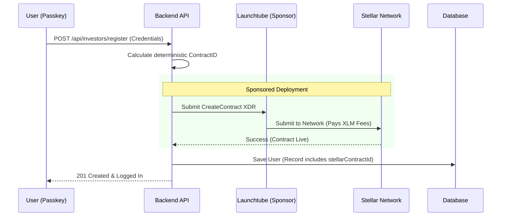
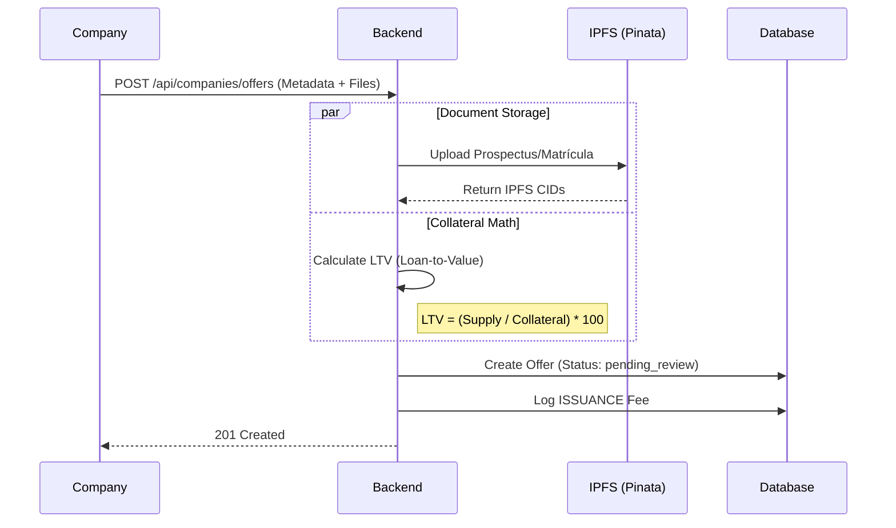
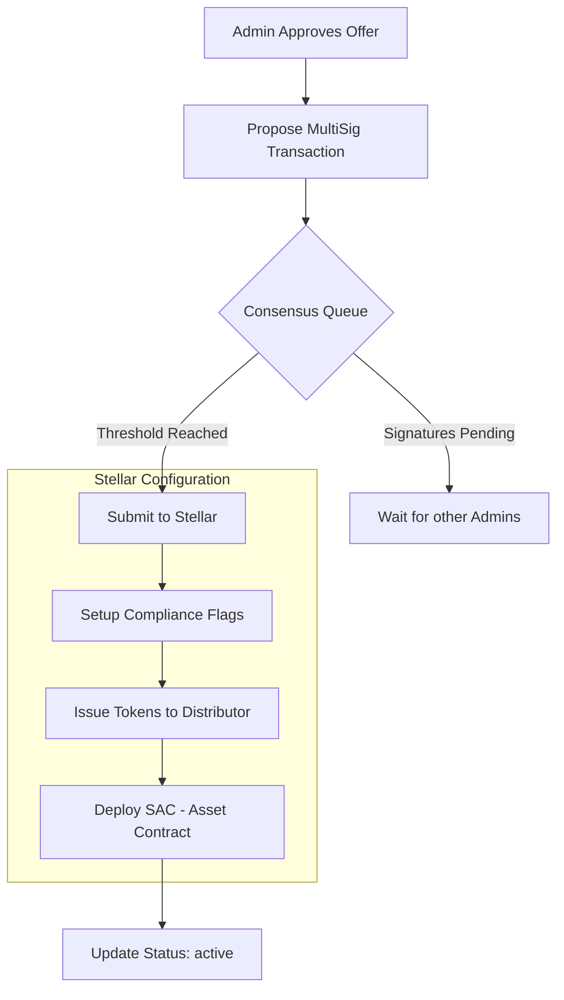
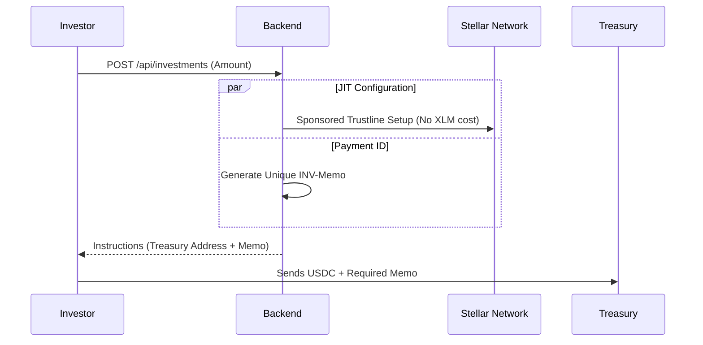
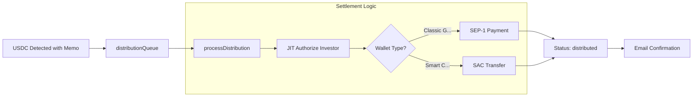

# System Flow: Tokenization & Investment Lifecycle

This document provides a comprehensive technical overview of the platform's end-to-end lifecycle, from user onboarding to token settlement.

---

## Phase 0: Onboarding & Smart Wallet Deployment
The journey begins with a 100% XLM-free registration flow for both Investors and Company Users.

### Automatic Wallet Deployment
When a user registers via Passkey, the platform triggers an on-chain deployment of a **Soroban Smart Wallet** (Contract).

- **Zero-Friction**: The user never sees a public key or handles a secret key. Their passkey *is* their wallet.
- **Sponsorship**: Launchtube sponsors the initial 20 XLM reserve required for the contract entry, ensuring the user starts with a 0 balance and 0 XLM cost.

---

## Phase 1: Offer Creation (Asset Tokenization)
Companies create investment offers, frequently backed by **Real Estate Collateral**.

### Offer Wizard & Collateral Validation
The flow in `CreateOffer.tsx` handles structured data and legal documents.

- **Collateral-Backed**: Offers specifically support `real_estate` types, storing valuation and LTV ratios for investor transparency.
- **Immutable Docs**: Legal documents are pinned to IPFS, ensuring the prospectus cannot be changed after the offer is published.

---

## Phase 2: Review & MultiSig Issuance
Platform Admins must approve and sign the token issuance via a secure multisig process.

### Admin Consensus Flow
Issuing tokens is a high-privilege operation that requires a MultiSig proposal.

- **Compliance Flags**: The asset is configured with `AuthRequired` (whitelisting), `AuthRevocable` (freezing), and `AuthClawbackEnabled`.
- **SAC (Stellar Asset Contract)**: Every asset gets a Soroban representation, enabling XLM-free transfers to smart wallets.

---

## Phase 3: Investment Flow
Investors browse the marketplace and purchase tokens using USDC.

### JIT (Just-In-Time) Onboarding
To maintain the XLM-free experience, the platform performs JIT trustline setup.

---

## Phase 4: Settlement & Atomic Distribution
The final step is the automatic detection of payment and token delivery.

### Payment Monitoring & Settlement
The `PaymentMonitor` service watches the ledger for the specific memo.

- **JIT Authorization**: The issuer account "whitelists" the investor *immediately* before sending tokens.
- **Dual Support**: Supports both legacy wallets (Standard payments) and the new 100% XLM-free smart wallets (Contract transfers).

---

> **See also:** [TOKENIZATION.md](TOKENIZATION.md) for token lifecycle · [INVESTMENT_FLOW.md](INVESTMENT_FLOW.md) for user journey · [AUTHENTICATION.md](AUTHENTICATION.md) for passkey details
